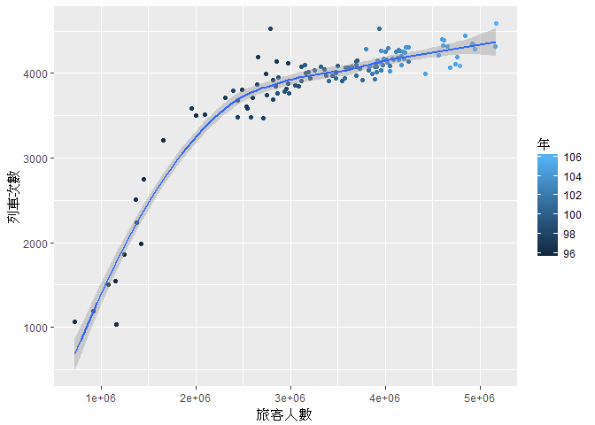

期末書面報告
================

組員：許家睿 蔡宇哲

分析議題背景
------------

現今的社會，人們日趨繁忙，汲汲於賺錢生活，哪怕是多一分休息、自由的時間都變得格外重要，因此，能夠省去大量交通時間的高鐵就成了大眾快速往返南北的工具，而搭乘高鐵的性價比的高低，我們將由搭乘人數來做觀察。

分析動機
--------

高鐵會定期的更新車次以及班次，班次的多寡是否會影響乘客搭乘的人數。 除了班次以外，票價也是會影響搭車的人數，因此我們希望得知價格的變化是否會影響乘客的數量。

使用資料
--------

說明使用資料們 1. 高鐵運量統計表 來源：政府資料開放平台 資料類型：CSV 主要欄位：月份、發車數、客座公里（座公里）、準點率、旅客人數（人次） 日期：104年12月29日

載入使用資料們

``` r
library(readr)
```

    ## Warning: package 'readr' was built under R version 3.3.3

``` r
library(dplyr)
```

    ## Warning: package 'dplyr' was built under R version 3.3.3

    ## 
    ## Attaching package: 'dplyr'

    ## The following objects are masked from 'package:stats':
    ## 
    ##     filter, lag

    ## The following objects are masked from 'package:base':
    ## 
    ##     intersect, setdiff, setequal, union

``` r
library(ggplot2) 
```

    ## Warning: package 'ggplot2' was built under R version 3.3.3

``` r
THSRC_NUMBER_MOD <- read_csv("D:/課用/R/data/THSRC_NUMBER_MOD.csv", 
    locale = locale())
```

    ## Parsed with column specification:
    ## cols(
    ##   年 = col_integer(),
    ##   月 = col_integer(),
    ##   旅客人數 = col_number(),
    ##   列車次數 = col_number(),
    ##   座位公里 = col_number(),
    ##   準點率 = col_character()
    ## )

資料處理與清洗
--------------

將資料依據年份作整理， 得出每一年的旅客人數、列車次數、準點率， 再利用這些資料來做每一年度的平均， 最後整理在同一張表中。

處理資料

``` r
travelers_pop<-group_by(THSRC_NUMBER_MOD, .dots=年)%>%
  summarise(Pop=sum(旅客人數))
travelers_mean<-group_by(THSRC_NUMBER_MOD, .dots=年)%>%
  summarise(meanPop=mean(旅客人數))

shifts_sum<-group_by(THSRC_NUMBER_MOD, .dots=年)%>%
  summarise(shift_num=sum(列車次數))
shifts_mean<-group_by(THSRC_NUMBER_MOD, .dots=年)%>%
  summarise(shift_mean=mean(列車次數))

THSRC_NUMBER_MOD$誤點數<-round(THSRC_NUMBER_MOD$列車次數*
                              (1-as.numeric(gsub("%","",THSRC_NUMBER_MOD$準點率))/100),0)
delay_sum<-group_by(THSRC_NUMBER_MOD, .dots=年)%>%
  summarise(num=sum(誤點數))
delay_mean<-group_by(THSRC_NUMBER_MOD, .dots=年)%>%
  summarise(num_mean=mean(誤點數))

THSRC_NUMBER_NEW<-merge(travelers_pop,travelers_mean,by=".dots")
THSRC_NUMBER_NEW$shift_sum<-shifts_sum$shift_num
THSRC_NUMBER_NEW$shift_mean<-shifts_mean$shift_mean
THSRC_NUMBER_NEW$delay_num<-delay_sum$num
```

探索式資料分析
--------------

``` r
qplot(旅客人數, 列車次數, 
      data = THSRC_NUMBER_MOD,
      color = 年,
      geom = c("point", "smooth"))
```

    ## `geom_smooth()` using method = 'loess'



``` r
##旅客人數與列車次數的關係
##起先由列車次數快速增加隨後旅客人數才有大幅的上升
##我們可以發現剛開始列車增加人數成長快但是到了後期搭車人數成長緩慢


knitr::kable(THSRC_NUMBER_MOD)
```

|  年 |  月 | 旅客人數 | 列車次數 |  座位公里  | 準點率  | 誤點數 |
|:---:|:---:|:--------:|:--------:|:----------:|:--------|:------:|
|  96 |  1  |  1161047 |   1034   |  318681191 | 99.61%  |    4   |
|  96 |  2  |  724784  |   1064   |  330495752 | 99.81%  |    2   |
|  96 |  3  |  919455  |   1190   |  378951174 | 99.92%  |    1   |
|  96 |  4  |  1076413 |   1500   |  484511100 | 99.93%  |    1   |
|  96 |  5  |  1155098 |   1550   |  500661470 | 99.94%  |    1   |
|  96 |  6  |  1241227 |   1860   |  584558340 | 99.03%  |   18   |
|  96 |  7  |  1425755 |   1982   |  622498358 | 99.39%  |   12   |
|  96 |  8  |  1373686 |   2240   |  718463006 | 99.64%  |    8   |
|  96 |  9  |  1367236 |   2509   |  789725401 | 99.96%  |    1   |
|  96 |  10 |  1448553 |   2754   |  890674609 | 98.00%  |   55   |
|  96 |  11 |  1659506 |   3214   | 1055026833 | 99.28%  |   23   |
|  96 |  12 |  2002896 |   3503   | 1164424068 | 99.89%  |    4   |
|  97 |  1  |  1958004 |   3589   | 1187956874 | 99.75%  |    9   |
|  97 |  2  |  2095210 |   3516   | 1158237240 | 98.86%  |   40   |
|  97 |  3  |  2311821 |   3712   | 1222643218 | 99.33%  |   25   |
|  97 |  4  |  2545527 |   3590   | 1182751721 | 99.78%  |    8   |
|  97 |  5  |  2603395 |   3715   | 1223669276 | 99.62%  |   14   |
|  97 |  6  |  2537620 |   3603   | 1186620238 | 99.53%  |   17   |
|  97 |  7  |  2811997 |   3918   | 1286050842 | 97.98%  |   79   |
|  97 |  8  |  2973150 |   4123   | 1351660360 | 99.03%  |   40   |
|  97 |  9  |  2488574 |   3808   | 1249040627 | 98.50%  |   57   |
|  97 |  10 |  2855980 |   4144   | 1357996966 | 99.30%  |   29   |
|  97 |  11 |  2741710 |   3994   | 1309400608 | 98.92%  |   43   |
|  97 |  12 |  2658273 |   4188   | 1373471038 | 99.71%  |   12   |
|  98 |  1  |  2786684 |   4524   | 1486215471 | 98.74%  |   57   |
|  98 |  2  |  2396835 |   3794   | 1244342942 | 99.58%  |   16   |
|  98 |  3  |  2648005 |   3870   | 1266766485 | 98.79%  |   47   |
|  98 |  4  |  2582952 |   3476   | 1135586273 | 99.97%  |    1   |
|  98 |  5  |  2752003 |   3743   | 1224151773 | 100.00% |    0   |
|  98 |  6  |  2436486 |   3476   | 1135586273 | 99.22%  |   27   |
|  98 |  7  |  2957323 |   3818   | 1249317942 | 99.92%  |    3   |
|  98 |  8  |  2716287 |   3471   | 1132766004 | 97.41%  |   90   |
|  98 |  9  |  2440872 |   3684   | 1205380446 | 99.81%  |    7   |
|  98 |  10 |  2839086 |   3852   | 1260707194 | 99.14%  |   33   |
|  98 |  11 |  2814651 |   3695   | 1209387622 | 99.11%  |   33   |
|  98 |  12 |  2978076 |   3883   | 1271444759 | 99.38%  |   24   |
|  99 |  1  |  2870737 |   3948   | 1293097370 | 99.59%  |   16   |
|  99 |  2  |  3047303 |   3857   | 1266153621 | 100.00% |    0   |
|  99 |  3  |  2938307 |   3780   | 1217024871 | 96.61%  |   128  |
|  99 |  4  |  3090380 |   3842   | 1258200282 | 99.77%  |    9   |
|  99 |  5  |  3212410 |   3938   | 1289583811 | 99.85%  |    6   |
|  99 |  6  |  2983161 |   3764   | 1232046879 | 99.73%  |   10   |
|  99 |  7  |  3160655 |   4000   | 1301868803 | 98.80%  |   48   |
|  99 |  8  |  3188488 |   4018   | 1304517152 | 99.10%  |   36   |
|  99 |  9  |  2865777 |   3767   | 1221675394 | 99.23%  |   29   |
|  99 |  10 |  3114371 |   4081   | 1326386065 | 99.44%  |   23   |
|  99 |  11 |  3114886 |   3915   | 1271001083 | 98.54%  |   57   |
|  99 |  12 |  3353121 |   4050   | 1314564208 | 99.85%  |    6   |
| 100 |  1  |  3154725 |   4102   | 1333077631 | 99.98%  |    1   |
| 100 |  2  |  3439685 |   3977   | 1296341952 | 99.75%  |   10   |
| 100 |  3  |  3258311 |   4031   | 1308543739 | 99.88%  |    5   |
| 100 |  4  |  3476554 |   4012   | 1304772277 | 99.93%  |    3   |
| 100 |  5  |  3318438 |   4076   | 1324175879 | 99.93%  |    3   |
| 100 |  6  |  3380395 |   3975   | 1291488978 | 99.80%  |    8   |
| 100 |  7  |  3691078 |   4135   | 1344505705 | 99.95%  |    2   |
| 100 |  8  |  3500945 |   4083   | 1325992282 | 99.78%  |    9   |
| 100 |  9  |  3474884 |   4007   | 1302226543 | 99.93%  |    3   |
| 100 |  10 |  3702168 |   4152   | 1350545586 | 99.83%  |    7   |
| 100 |  11 |  3540421 |   3906   | 1268158623 | 99.80%  |    8   |
| 100 |  12 |  3691699 |   4097   | 1331222407 | 99.83%  |    7   |
| 101 |  1  |  3940570 |   4524   | 1476809031 | 99.98%  |    1   |
| 101 |  2  |  3401837 |   3905   | 1270288384 | 98.13%  |   73   |
| 101 |  3  |  3612732 |   4068   | 1321491489 | 99.58%  |   17   |
| 101 |  4  |  3569495 |   3946   | 1282448569 | 99.75%  |   10   |
| 101 |  5  |  3577726 |   4071   | 1321294598 | 99.80%  |    8   |
| 101 |  6  |  3482425 |   3943   | 1281106374 | 99.39%  |   24   |
| 101 |  7  |  3902874 |   4105   | 1334794199 | 99.90%  |    4   |
| 101 |  8  |  3730155 |   4055   | 1318194233 | 96.33%  |   149  |
| 101 |  9  |  3696134 |   3969   | 1291073004 | 100.00% |    0   |
| 101 |  10 |  3826495 |   4037   | 1311799393 | 99.88%  |    5   |
| 101 |  11 |  3762009 |   3923   | 1274572875 | 99.95%  |    2   |
| 101 |  12 |  4023302 |   4136   | 1345196215 | 100.00% |    0   |
| 102 |  1  |  3647415 |   4072   | 1323721085 | 99.75%  |   10   |
| 102 |  2  |  3956747 |   4032   | 1312667381 | 99.90%  |    4   |
| 102 |  3  |  4245483 |   4141   | 1335515239 | 99.25%  |   31   |
| 102 |  4  |  3913418 |   4012   | 1304178823 | 99.80%  |    8   |
| 102 |  5  |  3904892 |   4077   | 1324688909 | 99.95%  |    2   |
| 102 |  6  |  3890726 |   3931   | 1278480215 | 98.02%  |   78   |
| 102 |  7  |  4052344 |   4085   | 1327589602 | 98.53%  |   60   |
| 102 |  8  |  4136920 |   4177   | 1358598759 | 99.07%  |   39   |
| 102 |  9  |  3975780 |   4099   | 1333097043 | 100.00% |    0   |
| 102 |  10 |  3886353 |   4080   | 1322855876 | 99.53%  |   19   |
| 102 |  11 |  3861841 |   3996   | 1295340865 | 99.15%  |   34   |
| 102 |  12 |  4014940 |   4157   | 1341593941 | 99.57%  |   18   |
| 103 |  1  |  3799436 |   4291   | 1378925855 | 99.86%  |    6   |
| 103 |  2  |  3832719 |   4081   | 1313055653 | 99.56%  |   18   |
| 103 |  3  |  4001023 |   4252   | 1362625396 | 99.67%  |   14   |
| 103 |  4  |  3984512 |   4167   | 1336372157 | 98.90%  |   46   |
| 103 |  5  |  4029882 |   4297   | 1377212068 | 99.53%  |   20   |
| 103 |  6  |  3915932 |   4148   | 1328418819 | 99.69%  |   13   |
| 103 |  7  |  4078266 |   4174   | 1332922393 | 99.54%  |   19   |
| 103 |  8  |  4139391 |   4279   | 1367622588 | 98.88%  |   48   |
| 103 |  9  |  3949938 |   4132   | 1322880610 | 99.98%  |    1   |
| 103 |  10 |  4155844 |   4269   | 1367292580 | 99.91%  |    4   |
| 103 |  11 |  4018332 |   4125   | 1320531754 | 99.95%  |    2   |
| 103 |  12 |  4119483 |   4252   | 1359635934 | 99.88%  |    5   |
| 104 |  1  |  3955998 |   4263   | 1367409035 | 99.74%  |   11   |
| 104 |  2  |  4140433 |   4162   | 1345115620 | 98.75%  |   52   |
| 104 |  3  |  4193956 |   4256   | 1360090738 | 99.98%  |    1   |
| 104 |  4  |  4175062 |   4202   | 1350096253 | 100.00% |    0   |
| 104 |  5  |  4213646 |   4306   | 1379530482 | 99.91%  |    4   |
| 104 |  6  |  4087705 |   4165   | 1334663710 | 99.95%  |    2   |
| 104 |  7  |  4211651 |   4242   | 1355038067 | 99.86%  |    6   |
| 104 |  8  |  4194775 |   4170   | 1331588322 | 99.62%  |   16   |
| 104 |  9  |  4047485 |   4027   | 1290626109 | 98.61%  |   56   |
| 104 |  10 |  4241446 |   4304   | 1380969732 | 99.67%  |   14   |
| 104 |  11 |  4170979 |   4100   | 1311610542 | 99.95%  |    2   |
| 104 |  12 |  4928818 |   4335   | 1380209978 | 99.86%  |    6   |
| 105 |  1  |  4604235 |   4398   | 1397800084 | 99.66%  |   15   |
| 105 |  2  |  4841423 |   4439   | 1393474119 | 98.67%  |   59   |
| 105 |  3  |  4611193 |   4327   | 1370248891 | 99.65%  |   15   |
| 105 |  4  |  4654341 |   4314   | 1368510111 | 99.61%  |   17   |
| 105 |  5  |  4618120 |   4389   | 1393715247 | 99.32%  |   30   |
| 105 |  6  |  4563193 |   4213   | 1339588912 | 99.19%  |   34   |
| 105 |  7  |  4737535 |   4107   | 1354326240 | 99.71%  |   12   |
| 105 |  8  |  4762706 |   4196   | 1385163896 | 99.76%  |   10   |
| 105 |  9  |  4420684 |   3996   | 1312705806 | 99.61%  |   16   |
| 105 |  10 |  4923512 |   4344   | 1431751580 | 99.78%  |   10   |
| 105 |  11 |  4684505 |   4067   | 1343202374 | 99.93%  |    3   |
| 105 |  12 |  5164763 |   4316   | 1422039368 | 99.79%  |    9   |
| 106 |  1  |  5175232 |   4586   | 1505542380 | 99.80%  |    9   |
| 106 |  2  |  4792273 |   4091   | 1338688518 | 99.95%  |    2   |
| 106 |  3  |  4949836 |   4282   | 1412690417 | 99.93%  |    3   |

``` r
##7,8月正值暑假相較前面兩三個月都會有暴增的現象
##也多半是一年中的巔峰時期
```

期末專題分析規劃
----------------

搭乘高鐵的人數越來越多，其中影響人們搭乘的原因有很多種，我們想透過分析來了解哪種原因對於高鐵搭乘人數影響最多。列車班次數、票價、開站數量、準點率這些都是可能對旅客人數的造成影響的原因。
