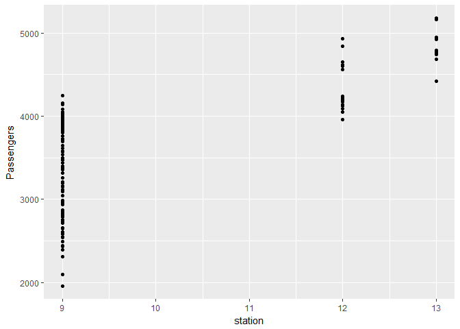

期末書面報告
================

組員：許家睿 蔡宇哲

分析議題背景
------------

現今的社會，人們日趨繁忙，汲汲於賺錢生活，哪怕是多一分休息、自由的時間都變得格外重要，因此，能夠省去大量交通時間的高鐵就成了大眾快速往返南北的工具，我們將使用高鐵相關資料來做觀察。

分析動機
--------

高鐵會定期的更新車次以及班次，班次的多寡是否會影響乘客搭乘的人數。 除了班次以外，還有許多因素也是會影響搭車的人數，因此我們希望得知這些因素是否會影響乘客的數量，以及高鐵班次及人數的如何安排會有較佳的組合。

使用資料
--------

說明使用資料們 1. 高鐵運量統計表 來源：政府資料開放平台 資料類型：CSV 主要欄位：月份、發車數、客座公里（座公里）、準點率、旅客人數（人次） 日期：104年12月29日 2. 高速鐵路客運量 來源：中華民國交通部 資料類型：XLS 主要欄位：年（月）別、旅客人數、延人公里、平均每一旅客運距、客座利用率、準點率

載入使用資料們

``` r
library(readr)
```

    ## Warning: package 'readr' was built under R version 3.3.3

``` r
library(dplyr)
```

    ## Warning: package 'dplyr' was built under R version 3.3.3

    ## 
    ## Attaching package: 'dplyr'

    ## The following objects are masked from 'package:stats':
    ## 
    ##     filter, lag

    ## The following objects are masked from 'package:base':
    ## 
    ##     intersect, setdiff, setequal, union

``` r
library(ggplot2)
```

    ## Warning: package 'ggplot2' was built under R version 3.3.3

``` r
library(readxl)
```

    ## Warning: package 'readxl' was built under R version 3.3.3

``` r
THSRC_NUMBER_MOD <- read_csv("D:/課用/R/data/THSRC_NUMBER_MOD.csv", 
    locale = locale())
```

    ## Parsed with column specification:
    ## cols(
    ##   年 = col_integer(),
    ##   月 = col_integer(),
    ##   旅客人數 = col_number(),
    ##   列車次數 = col_number(),
    ##   座位公里 = col_number(),
    ##   準點率 = col_character()
    ## )

``` r
THSRC_2_8_MOD <- read_excel("D:/課用/R/data/THSRC_2_8_MOD.xls")
THSRC_2_8_Month <- read_excel("D:/課用/R/data/THSRC_2_8_Month.xls")
```

資料處理與清洗
--------------

將資料依據年份作整理， 得出每一年的旅客人數、列車次數、準點率， 再利用這些資料來做每一年度的平均， 最後整理在同一張表中。

處理資料

``` r
travelers_pop<-group_by(THSRC_NUMBER_MOD, .dots=年)%>%
  summarise(Pop=sum(旅客人數))
travelers_mean<-group_by(THSRC_NUMBER_MOD, .dots=年)%>%
  summarise(meanPop=mean(旅客人數))

shifts_sum<-group_by(THSRC_NUMBER_MOD, .dots=年)%>%
  summarise(shift_num=sum(列車次數))
shifts_mean<-group_by(THSRC_NUMBER_MOD, .dots=年)%>%
  summarise(shift_mean=mean(列車次數))

THSRC_NUMBER_MOD$誤點數<-round(THSRC_NUMBER_MOD$列車次數*
                              (1-as.numeric(gsub("%","",THSRC_NUMBER_MOD$準點率))/100),0)
delay_sum<-group_by(THSRC_NUMBER_MOD, .dots=年)%>%
  summarise(num=sum(誤點數))
delay_mean<-group_by(THSRC_NUMBER_MOD, .dots=年)%>%
  summarise(num_mean=mean(誤點數))

THSRC_NUMBER_NEW<-merge(travelers_pop,travelers_mean,by=".dots")
THSRC_NUMBER_NEW$shift_sum<-shifts_sum$shift_num
THSRC_NUMBER_NEW$shift_mean<-shifts_mean$shift_mean
THSRC_NUMBER_NEW$delay_num<-delay_sum$num
```

探索式資料分析
--------------

``` r
qplot(旅客人數, 列車次數, 
      data = THSRC_NUMBER_MOD,
      color = 年,
      geom = c("point", "smooth"))
```

    ## `geom_smooth()` using method = 'loess'


``` r
##在高鐵剛開放時，旅客人數的成長幅度還不是很大，
##而是在列車班次大幅增加之後，人數數量才有大幅的成長
##但是隨著人數的上升似乎也會到達飽和的狀態。


knitr::kable(head(THSRC_NUMBER_MOD,12))
```

|  年 |  月 | 旅客人數 | 列車次數 |  座位公里  | 準點率 | 誤點數 |
|:---:|:---:|:--------:|:--------:|:----------:|:-------|:------:|
|  96 |  1  |  1161047 |   1034   |  318681191 | 99.61% |    4   |
|  96 |  2  |  724784  |   1064   |  330495752 | 99.81% |    2   |
|  96 |  3  |  919455  |   1190   |  378951174 | 99.92% |    1   |
|  96 |  4  |  1076413 |   1500   |  484511100 | 99.93% |    1   |
|  96 |  5  |  1155098 |   1550   |  500661470 | 99.94% |    1   |
|  96 |  6  |  1241227 |   1860   |  584558340 | 99.03% |   18   |
|  96 |  7  |  1425755 |   1982   |  622498358 | 99.39% |   12   |
|  96 |  8  |  1373686 |   2240   |  718463006 | 99.64% |    8   |
|  96 |  9  |  1367236 |   2509   |  789725401 | 99.96% |    1   |
|  96 |  10 |  1448553 |   2754   |  890674609 | 98.00% |   55   |
|  96 |  11 |  1659506 |   3214   | 1055026833 | 99.28% |   23   |
|  96 |  12 |  2002896 |   3503   | 1164424068 | 99.89% |    4   |

``` r
##7,8月正值暑假相較前面兩三個月都會有暴增的現象
##年中以及年尾是一年中的巔峰時期
```

期末專題分析規劃
----------------

搭乘高鐵的人數越來越多，其中影響人們搭乘的原因有很多種，我們想透過分析來了解哪種原因對於高鐵搭乘人數影響最多。列車班次數、票價、開站數量、準點率這些都是可能對旅客人數的造成影響的原因。

期末專題分析過程&結果
---------------------

``` r
##班次數&客座率&搭乘人數
#整理出2_8年度資料
THSRC2_8<-THSRC_2_8_MOD[grepl("年",THSRC_2_8_MOD$Year),]
THSRC2_8$Shift_sum<-THSRC_NUMBER_NEW$shift_sum
#去除106年資料
THSRC2_8<-THSRC2_8[-11,]
lm(Seat_Utilization_Percentage~Shift_sum,
   data =THSRC2_8)
```

    ## 
    ## Call:
    ## lm(formula = Seat_Utilization_Percentage ~ Shift_sum, data = THSRC2_8)
    ## 
    ## Coefficients:
    ## (Intercept)    Shift_sum  
    ##   28.536070     0.000526

``` r
qplot(Shift_sum, Seat_Utilization_Percentage, 
      data = THSRC2_8,
      geom = c("point", "smooth"))
```

    ## `geom_smooth()` using method = 'loess'


``` r
##每年資料筆數太少改作每月
qplot(Shift_sum, Seat_Utilization_Percentage, 
      data = THSRC_2_8_Month,
      
      geom = c("point", "smooth"))
```

    ## `geom_smooth()` using method = 'loess'


``` r
##這張圖是利用高鐵的空位百分比以及班次數做出來的圖表。其中每個點代表了每個月分資料。
##我們可以看出來斜線當中當班次越多的時候空位率是越低的，
##但是當超過一定的數量時，空位率又會變高。

summary(lm(Seat_Utilization_Percentage~Shift_sum,
   data =THSRC_2_8_Month))
```

    ## 
    ## Call:
    ## lm(formula = Seat_Utilization_Percentage ~ Shift_sum, data = THSRC_2_8_Month)
    ## 
    ## Residuals:
    ##      Min       1Q   Median       3Q      Max 
    ## -21.9328  -2.5757   0.7665   2.6682  10.3418 
    ## 
    ## Coefficients:
    ##               Estimate Std. Error t value Pr(>|t|)    
    ## (Intercept) -23.022882   8.893026  -2.589   0.0109 *  
    ## Shift_sum     0.019018   0.002194   8.670 4.55e-14 ***
    ## ---
    ## Signif. codes:  0 '***' 0.001 '**' 0.01 '*' 0.05 '.' 0.1 ' ' 1
    ## 
    ## Residual standard error: 5.221 on 109 degrees of freedom
    ## Multiple R-squared:  0.4081, Adjusted R-squared:  0.4027 
    ## F-statistic: 75.16 on 1 and 109 DF,  p-value: 4.546e-14

``` r
##由P值小於0.05，我們可以說這個回歸分析結果是顯著的

#列車次數&旅客人數&站數

qplot(Shift_sum, Passengers, 
      data = THSRC_2_8_Month,
      geom = c("point", "smooth"))
```

    ## `geom_smooth()` using method = 'loess'


``` r
##這張圖是使用搭乘人數與班次所製作出的圖表，其中每個點代表了每個月分資料。
##我們可以看出當班次越來越多的時候，搭乘人數也逐漸上升，但是跟上一張圖表一樣，
##班次超過一定數量時，搭乘人數有些許下降的現象。

summary(lm(Passengers~Shift_sum,
   data =THSRC_2_8_Month))
```

    ## 
    ## Call:
    ## lm(formula = Passengers ~ Shift_sum, data = THSRC_2_8_Month)
    ## 
    ## Residuals:
    ##      Min       1Q   Median       3Q      Max 
    ## -2052.39  -197.31    31.91   217.38  1047.04 
    ## 
    ## Coefficients:
    ##               Estimate Std. Error t value Pr(>|t|)    
    ## (Intercept) -6589.4060   780.3936  -8.444 1.47e-13 ***
    ## Shift_sum       2.5262     0.1925  13.123  < 2e-16 ***
    ## ---
    ## Signif. codes:  0 '***' 0.001 '**' 0.01 '*' 0.05 '.' 0.1 ' ' 1
    ## 
    ## Residual standard error: 458.2 on 109 degrees of freedom
    ## Multiple R-squared:  0.6124, Adjusted R-squared:  0.6089 
    ## F-statistic: 172.2 on 1 and 109 DF,  p-value: < 2.2e-16

``` r
##由P值小於0.05，我們可以說這個回歸分析結果是顯著的
THSRC_NUMBER_NEW<-THSRC_NUMBER_NEW[-11,]


qplot(station, Passengers, 
      data = THSRC_2_8_Month,
      )
```

    ## Warning: Ignoring unknown parameters: NA



``` r
##這是利用車站數及搭乘人數所做的圖表，當車站數量增加，搭乘人數也會增加，
##但是在車站數為9的時候，搭乘人數已有超越車站數12時期的人數
##因此我們認為這兩者的關係並沒有那麼直接的相關，而是還要從車站設立在哪個地點，以及那個區域的需求人數，才能做進一步的探討
summary(lm(Passengers~station,
   data =THSRC_2_8_Month))
```

    ## 
    ## Call:
    ## lm(formula = Passengers ~ station, data = THSRC_2_8_Month)
    ## 
    ## Residuals:
    ##      Min       1Q   Median       3Q      Max 
    ## -1381.16  -358.54    35.66   431.01   906.32 
    ## 
    ## Coefficients:
    ##             Estimate Std. Error t value Pr(>|t|)    
    ## (Intercept)   149.90     334.73   0.448    0.655    
    ## station       354.36      33.66  10.529   <2e-16 ***
    ## ---
    ## Signif. codes:  0 '***' 0.001 '**' 0.01 '*' 0.05 '.' 0.1 ' ' 1
    ## 
    ## Residual standard error: 518.2 on 109 degrees of freedom
    ## Multiple R-squared:  0.5042, Adjusted R-squared:  0.4997 
    ## F-statistic: 110.9 on 1 and 109 DF,  p-value: < 2.2e-16

``` r
##由P值小於0.05，我們可以說這個回歸分析結果是顯著的


##結論
##班次著實會影響搭乘人數，而班次數則不一定，
##以目前高鐵的狀態，在不增加新的車站的情況下，
##班次數約落在2000~2200搭乘人數為圖表的高峰區段，
##會有較佳的效益
```
